# Diagramas del Proyecto HPC-MLP-Engine

## 1. Arquitectura General del Proyecto

```mermaid
graph TB
    subgraph "Dataset"
        MNIST["MNIST Dataset<br/>60K Train / 10K Test<br/>28x28 imágenes"]
    end
    
    subgraph "Secuencial"
        SEQC["C Secuencial<br/>clock()"]
        SEQPY["Python Secuencial<br/>time.time()"]
    end
    
    subgraph "Paralelo"
        OMP["OpenMP<br/>omp_get_wtime()"]
        MP["Multiprocessing<br/>time.time()"]
        CUDA["PyCUDA<br/>time.perf_counter()"]
    end
    
    subgraph "Análisis"
        RESULTS["Resultados<br/>Speedup<br/>Eficiencia<br/>Accuracy"]
    end
    
    MNIST --> SEQC
    MNIST --> SEQPY
    MNIST --> OMP
    MNIST --> MP
    MNIST --> CUDA
    
    SEQC --> RESULTS
    SEQPY --> RESULTS
    OMP --> RESULTS
    MP --> RESULTS
    CUDA --> RESULTS
```

---

## 2. Arquitectura de la Red Neuronal MLP

---

## 3. Flujo de Entrenamiento - Forward Pass

```mermaid
graph TD
    A["Input: X (batch_size × 784)"]
    B["Z1 = X · W1 + b1<br/>(batch_size × 500)"]
    C["A1 = ReLU(Z1)<br/>(batch_size × 500)"]
    D["Z2 = A1 · W2 + b2<br/>(batch_size × 10)"]
    E["A2 = Softmax(Z2)<br/>(batch_size × 10)"]
    F["Predicciones<br/>argmax(A2)"]
    
    A --> B
    B --> C
    C --> D
    D --> E
    E --> F
    
    style A fill:#e1f5ff
    style F fill:#f3e5f5
```

---

## 4. Flujo de Entrenamiento - Backward Pass

```mermaid
graph TD
    A["Loss Function<br/>Cross-Entropy"]
    B["dL/dA2 = A2 - Y<br/>(batch_size × 10)"]
    C["dL/dZ2 = dL/dA2<br/>(batch_size × 10)"]
    D["dL/dW2 = A1ᵀ · dZ2<br/>(500 × 10)"]
    E["dL/db2 = sum(dZ2)"]
    F["dL/dA1 = dZ2 · W2ᵀ<br/>(batch_size × 500)"]
    G["dL/dZ1 = dL/dA1 * ReLU'<br/>(batch_size × 500)"]
    H["dL/dW1 = Xᵀ · dZ1<br/>(784 × 500)"]
    I["dL/db1 = sum(dZ1)"]
    
    A --> B
    B --> C
    C --> D
    C --> E
    D --> F
    E --> F
    F --> G
    G --> H
    G --> I
    
    style A fill:#ffe0b2
    style D fill:#c8e6c9
    style H fill:#c8e6c9
```

---

## 5. Estructura de Directorios

```mermaid
graph TB
    ROOT["HPC-MLP-Engine"]
    
    Dataset["📁 Dataset/<br/>archive/<br/>  ├─ train-images.idx3-ubyte<br/>  ├─ train-labels.idx1-ubyte<br/>  ├─ t10k-images.idx3-ubyte<br/>  └─ t10k-labels.idx1-ubyte"]
    
    Secuencial["📁 Secuencial/"]
    SeqC["📁 C/<br/>  ├─ main.c<br/>  ├─ build_run.sh<br/>  └─ [network, linalg, common]"]
    SeqPy["📁 Python/<br/>  ├─ Main.py<br/>  └─ src/<br/>     ├─ MLP.py<br/>     ├─ DenseLayer.py<br/>     ├─ Activations.py<br/>     └─ DataLoader.py"]
    
    Paralelo["📁 Paralelo/"]
    OMP["📁 OpenMP/<br/>  ├─ main.c<br/>  ├─ build_run.sh<br/>  └─ [network, linalg, common]"]
    MP["📁 Multiprocessing/<br/>  ├─ Main.py<br/>  └─ src/<br/>     └─ [MLP, DenseLayer, ...]"]
    CUDA["📁 PyCuda/<br/>  └─ train_pycuda.py"]
    
    ROOT --> Dataset
    ROOT --> Secuencial
    ROOT --> Paralelo
    
    Secuencial --> SeqC
    Secuencial --> SeqPy
    
    Paralelo --> OMP
    Paralelo --> MP
    Paralelo --> CUDA
```

---

## 6. Comparación de Métodos de Medición de Tiempo

```mermaid
graph LR
    A["C Secuencial<br/>clock()"]
    B["Python Secuencial<br/>time.time()"]
    C["OpenMP<br/>omp_get_wtime()"]
    D["Multiprocessing<br/>time.time()"]
    E["PyCUDA<br/>time.perf_counter()<br/>+ Event timing"]
    
    A -.->|Wall-clock| A1["❌ Mide CPU<br/>time consumed"]
    B -.->|Wall-clock| B1["✅ Mide tiempo real<br/>transcurrido"]
    C -.->|Wall-clock| C1["✅ Recomendado para<br/>OpenMP"]
    D -.->|Wall-clock| D1["✅ Mide tiempo real<br/>+ overhead<br/>multiprocessing"]
    E -.->|Wall-clock| E1["✅ Mide tiempo GPU<br/>+ transferencias<br/>+ CPU"]
    
    style A fill:#ffcdd2
    style B fill:#c8e6c9
    style C fill:#c8e6c9
    style D fill:#c8e6c9
    style E fill:#c8e6c9
```

---

## 7. Pipeline de Procesamiento - Multiprocessing

---

## 8. Comparación de Speedup: Secuencial vs Paralelo

```mermaid
graph LR
    BASE["Secuencial<br/>T = 100s<br/>Speedup = 1.0x"]
    
    OMP_RES["OpenMP<br/>T ≈ 25-35s<br/>Speedup ≈ 2.8x<br/>(4 threads)"]
    
    MP_RES["Multiprocessing<br/>T ≈ 50-80s<br/>Speedup ≈ 1.2-2.0x<br/>(1-4 procesos)"]
    
    CUDA_RES["PyCUDA<br/>T ≈ 15-20s<br/>Speedup ≈ 5-7x<br/>(GPU)"]
    
    BASE -->|2.8x| OMP_RES
    BASE -->|1.5-2x| MP_RES
    BASE -->|5-7x| CUDA_RES
    
    style BASE fill:#ffcdd2
    style OMP_RES fill:#fff9c4
    style MP_RES fill:#fff9c4
    style CUDA_RES fill:#c8e6c9
```

---

## 9. Operaciones Clave y Paralelismo - OpenMP

```mermaid
graph TD
    subgraph "Forward Pass"
        FP1["X · W1 (batch×784×500)<br/>100M operaciones"]
        FP2["A1 · W2 (batch×500×10)<br/>1.3M operaciones"]
    end
    
    subgraph "Backward Pass"
        BP1["A1ᵀ · dZ2 (784×batch×10)<br/>100M operaciones"]
        BP2["Cálc. gradientes<br/>Overhead bajo"]
    end
    
    subgraph "OpenMP Decision"
        D1["¿Suficiente trabajo?<br/>if work ≥ 1M ops"]
        YES["✅ Paralelizar<br/>#pragma omp"]
        NO["❌ Secuencial SIMD<br/>#pragma omp simd"]
    end
    
    FP1 --> D1
    FP2 --> D1
    BP1 --> D1
    BP2 --> D1
    
    D1 --> YES
    D1 --> NO
    
    style FP1 fill:#c8e6c9
    style BP1 fill:#c8e6c9
    style YES fill:#c8e6c9
    style NO fill:#ffccbc
```

---

## 10. Flujo de Ejecución Completo

```mermaid
sequenceDiagram
    participant User
    participant Program
    participant DataLoader
    participant Network
    participant GPU as GPU/CPU
    participant Results
    
    User->>Program: Ejecutar
    Program->>DataLoader: Cargar MNIST
    DataLoader->>DataLoader: Normalizar imágenes
    DataLoader->>Program: Retornar X_train, Y_train
    
    loop 10 Épocas
        loop Para cada batch
            Program->>Network: Forward Pass
            Network->>GPU: Operaciones matriciales
            GPU->>Network: Resultados
            Network->>Network: Backward Pass
            Network->>Network: Update Weights
        end
        Program->>Network: Evaluar en Test
    end
    
    Program->>Results: Calcular métricas
    Results->>User: Mostrar tiempo, accuracy
```

---

## 11. Componentes Python - Arquitectura

---

## 12. Comparativa: Herramientas de Medición de Tiempo

```mermaid
graph TB
    subgraph "C"
        C1["clock()<br/>→ CPU time"]
        C2["omp_get_wtime()<br/>→ Wall-clock time"]
    end
    
    subgraph "Python"
        P1["time.time()<br/>→ Wall-clock time<br/>Baja resolución"]
        P2["time.perf_counter()<br/>→ Wall-clock time<br/>Alta resolución"]
    end
    
    subgraph "GPU"
        G1["CUDA Events<br/>→ GPU execution time"]
        G2["time.perf_counter()<br/>→ CPU-GPU overhead"]
    end
    
    C1 -->|Recomendación| R1["❌ No usar para<br/>paralelismo"]
    C2 -->|Recomendación| R2["✅ Ideal para<br/>OpenMP"]
    P1 -->|Recomendación| R3["✅ Suficiente para<br/>Python"]
    P2 -->|Recomendación| R4["✅ Mejor para<br/>mediciones finas"]
    G1 -->|Recomendación| R5["✅ Mide kernels<br/>GPU"]
    G2 -->|Recomendación| R6["✅ Mide total<br/>incluyendo overhead"]
```

---

## 13. Estructura de Datos Principales

---

## 14. Performance Scaling - Ley de Amdahl

```mermaid
graph TD
    A["Fracción Paralela: 95%<br/>Fracción Secuencial: 5%"]
    
    A --> B["Speedup(N) = 1 / (S + P/N)<br/>S = fracción secuencial<br/>P = fracción paralela<br/>N = número de procesadores"]
    
    B --> C["Núcleos = 1: Speedup = 1.0x"]
    B --> D["Núcleos = 4: Speedup ≈ 3.5x<br/>(limitado por 5% secuencial)"]
    B --> E["Núcleos = ∞: Speedup máx = 20x<br/>(inverso de 5%)"]
    
    style A fill:#fff3e0
    style B fill:#ffe0b2
    style C fill:#ffccbc
    style D fill:#c8e6c9
    style E fill:#c8e6c9
```

---

## 15. Benchmarking Workflow

```mermaid
flowchart TD
    A["Inicio: Preparar Sistema"]
    B["Cargar Dataset MNIST"]
    C["Ejecutar C Secuencial"]
    D["Ejecutar Python Secuencial"]
    E["Ejecutar OpenMP"]
    F["Ejecutar Multiprocessing"]
    G["Ejecutar PyCUDA"]
    H["Recolectar Tiempos"]
    I["Calcular Speedup = T_base / T_versión"]
    J["Calcular Eficiencia = Speedup / N_procs"]
    K["Generar Gráficas"]
    L["Guardar en CSV"]
    M["Análisis de Resultados"]
    N["Fin"]
    
    A --> B
    B --> C
    C --> D
    D --> E
    E --> F
    F --> G
    G --> H
    H --> I
    I --> J
    J --> K
    K --> L
    L --> M
    M --> N
    
    style B fill:#e1f5ff
    style I fill:#fff3e0
    style K fill:#c8e6c9
    style M fill:#f3e5f5
```

